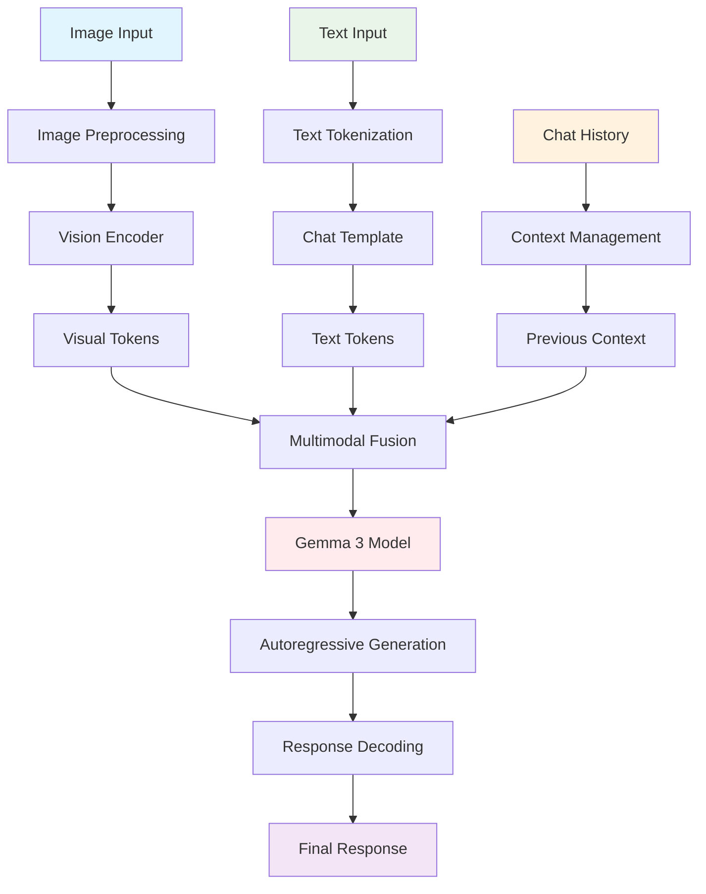

# Visual Question Answering (VQA) System

A powerful web application that enables users to ask and receive intelligent answers to questions about images. This system takes an image and a text-based question as inputs and generates contextually relevant natural language answers as output, leveraging Google's state-of-the-art Gemma 3 multimodal model running entirely locally.

## About Visual Question Answering (VQA)

Visual Question Answering is an advanced AI task that combines computer vision and natural language processing. A VQA system interprets visual content (images) and natural language questions to generate relevant textual answers. The system must:

1. **Visual Understanding**: Analyze and comprehend image content including objects, relationships, activities, scenes, and spatial arrangements
2. **Language Comprehension**: Parse and understand natural language questions with varying complexity
3. **Multimodal Reasoning**: Connect visual elements with linguistic queries through sophisticated reasoning
4. **Answer Generation**: Produce coherent, contextually appropriate responses in natural language

This implementation uses Google's cutting-edge **Gemma 3** multimodal model (4B parameters) running locally to seamlessly bridge visual understanding with language comprehension and generation. The model supports images up to 896x896 resolution and can handle complex visual reasoning tasks.

## Model Performance & Capabilities

Based on Google's official benchmarks, the Gemma 3 4B model demonstrates exceptional performance across various multimodal tasks:

### Multimodal Benchmarks

-   **DocVQA**: 72.8% accuracy on document visual question answering
-   **TextVQA**: 58.9% accuracy on text-based visual questions
-   **VQAv2**: 63.9% accuracy on general visual question answering
-   **ChartQA**: 63.6% accuracy on chart and graph interpretation
-   **AI2D**: 63.2% accuracy on diagram understanding
-   **OKVQA**: 51.0% accuracy on outside knowledge VQA
-   **RealWorldQA**: 45.5% accuracy on real-world scenarios

### Key Capabilities

-   **128K context window** for extended conversations
-   **Multilingual support** across 140+ languages
-   **High-resolution image processing** (896x896 pixels)
-   **Document analysis** including text extraction and interpretation
-   **Chart and diagram understanding**
-   **Spatial reasoning** and object relationship comprehension

## Features

-   🖼️ **Advanced Image Analysis**: Upload custom images for comprehensive visual analysis
-   💬 **Natural Language Interface**: Intuitive chat-based interaction for image-related questions
-   🔄 **Contextual Conversations**: Maintain conversation history for follow-up questions and clarifications
-   🧠 **Multimodal Understanding**: Sophisticated reasoning combining vision and language processing
-   📝 **Text Recognition**: Extract and interpret text within images (OCR capabilities)
-   📊 **Chart & Document Analysis**: Understand graphs, charts, diagrams, and document layouts
-   🎨 **Visual Scene Description**: Detailed analysis of objects, colors, spatial relationships, and activities
-   💾 **Local Model Execution**: Complete privacy - no internet required for inference after setup
-   ⚡ **4-bit Quantization**: Optimized performance with reduced memory usage
-   🌐 **Multi-language Support**: Process questions and generate answers in 140+ languages
-   🎯 **Interactive Chat Interface**: User-friendly web interface with conversation history
-   🔄 **One-click Reset**: Easy conversation and image clearing
-   📷 **High-Resolution Support**: Process images up to 896x896 pixels for detailed analysis

## Technical Overview

This VQA system leverages cutting-edge technologies for optimal performance:

### Core Technologies

-   **Gemma 3 (4B parameters)**: Google's state-of-the-art multimodal model with vision-language capabilities
-   **Transformers 4.50+**: Latest version supporting Gemma 3 architecture for model loading and inference
-   **PyTorch with bfloat16**: Efficient model inference with mixed precision for faster processing
-   **BitsAndBytesConfig**: 4-bit quantization (NF4) for memory optimization without significant quality loss
-   **Gradio**: Modern web interface framework for interactive applications
-   **PIL/Pillow**: Advanced image processing and manipulation

### Model Architecture

-   **Text Model**: 34 layers, 2560 hidden size, 10240 intermediate size
-   **Vision Model**: SigLIP-based vision encoder with 27 layers, 1152 hidden size
-   **Image Processing**: 896x896 resolution, 14x14 patch size, 256 tokens per image
-   **Context Window**: 128K tokens for extended conversations
-   **Quantization**: 4-bit NF4 quantization with double quantization for efficiency

### Performance Optimizations

-   **Device Auto-mapping**: Automatic GPU/CPU allocation based on available hardware
-   **Memory Optimization**: 4-bit quantization reduces memory usage by ~75%
-   **Inference Mode**: torch.inference_mode() for faster generation
-   **Greedy Decoding**: Deterministic output for consistent results
-   **Image Preprocessing**: Optimal resizing and format conversion for model compatibility

## System Requirements

### Minimum Requirements

-   **Python**: 3.8 or higher
-   **RAM**: 8GB system memory
-   **Storage**: 10GB free disk space for model and dependencies
-   **GPU**: CUDA-compatible GPU with 4GB+ VRAM (optional but recommended)

### Recommended Requirements

-   **Python**: 3.10+
-   **RAM**: 16GB+ system memory
-   **GPU**: NVIDIA RTX 3060/A4000 or better with 8GB+ VRAM
-   **Storage**: 15GB+ free disk space (SSD preferred for faster loading)
-   **CUDA**: Version 11.8 or higher for optimal GPU acceleration

### Performance Notes

-   **CPU-only**: Functional but significantly slower (30-60s per response)
-   **GPU (4GB VRAM)**: Good performance with 4-bit quantization (3-8s per response)
-   **GPU (8GB+ VRAM)**: Optimal performance (1-3s per response)
-   **Model Size**: ~3.2GB with 4-bit quantization, ~6.4GB in full precision

## Installation

### Quick Start

1. **Clone the repository**:

    ```bash
    git clone https://github.com/ifsvivek/VQA
    cd VQA
    ```

2. **Set up Python environment** (recommended):

    ```bash
    python -m venv venv
    source venv/bin/activate  # On Windows: venv\Scripts\activate
    ```

3. **Install dependencies**:
    ```bash
    pip install -r requirements.txt
    ```

### Model Setup

The Gemma 3 model should be placed in the `./gemma/` directory. If you haven't downloaded it yet:

1. **Option A - Manual Download**: Download the model files from Hugging Face and place them in `./gemma/`
2. **Option B - Automatic Download**: The app will attempt to download the model on first run (requires HF token)

### Hugging Face Authentication (if downloading)

```bash
# Install Hugging Face CLI
pip install huggingface_hub

# Login to Hugging Face (required for Gemma access)
huggingface-cli login
```

**Note**: You'll need to accept Google's Gemma license agreement on the Hugging Face model page before downloading.

## Usage

### Launch the Application

1. **Start the VQA system**:

    ```bash
    python app.py
    ```

2. **First Run**: Model loading may take 2-5 minutes depending on your hardware

3. **Access the Interface**: Open your browser to the provided URL (typically `http://127.0.0.1:7860`)

### Using the VQA System

#### Basic Workflow

1. **Upload an Image**: Click the image upload area or drag & drop your image
2. **Ask Questions**: Type your question in the text box
3. **Get Answers**: The AI will analyze the image and provide detailed responses
4. **Continue Conversation**: Ask follow-up questions for deeper analysis

#### Image Upload Tips

-   **Supported Formats**: JPG, PNG, WEBP, GIF (first frame)
-   **Recommended Size**: Images are automatically resized to 896x896 pixels
-   **Quality**: Higher resolution images generally produce better results
-   **Content**: Clear, well-lit images work best

### Example Questions by Category

#### General Description

-   "What do you see in this image?"
-   "Describe the main objects and their locations"
-   "What is the overall scene or setting?"

#### Specific Object Analysis

-   "How many people are in this image?"
-   "What animals can you identify?"
-   "What vehicles are present?"

#### Text and Document Analysis

-   "What text is visible in this image?"
-   "Can you read the signs or labels?"
-   "Summarize the content of this document"

#### Spatial and Relational Reasoning

-   "What is to the left of the building?"
-   "Which object is closest to the camera?"
-   "Describe the relationship between the objects"

#### Color and Visual Properties

-   "What are the dominant colors?"
-   "What time of day does this appear to be?"
-   "What is the weather like in this scene?"

#### Chart and Data Analysis

-   "What does this chart show?"
-   "What are the key trends in this graph?"
-   "Explain the data presented in this image"

## How It Works

### Architecture Overview



### Detailed Process Flow

1. **Image Processing Pipeline**:

    - Image upload and validation
    - Automatic resizing to 896x896 pixels using LANCZOS resampling
    - RGB conversion and uint8 normalization
    - Vision encoder processes image into 256 visual tokens

2. **Text Processing**:

    - Question tokenization using Gemma tokenizer
    - Chat template application for proper formatting
    - Integration with conversation history for context

3. **Multimodal Fusion**:

    - Visual tokens and text tokens are combined
    - Cross-attention mechanisms link visual and textual information
    - Gemma 3's multimodal architecture processes the combined input

4. **Response Generation**:

    - Autoregressive text generation with beam search/greedy decoding
    - Maximum of 150 tokens per response for optimal speed
    - Post-processing and formatting for user display

5. **Memory Management**:
    - 4-bit quantization reduces memory footprint
    - Conversation history limited to last 2 exchanges for efficiency
    - Automatic garbage collection between requests

### Model Capabilities

#### Vision Understanding

-   **Object Detection**: Identify and describe objects, people, animals
-   **Scene Analysis**: Understand settings, environments, and contexts
-   **Spatial Reasoning**: Describe positions, relationships, and layouts
-   **Text Recognition**: Extract and interpret text within images (OCR)
-   **Color Analysis**: Identify dominant colors and visual properties

#### Language Generation

-   **Contextual Responses**: Answers that directly address the question
-   **Descriptive Language**: Rich, detailed descriptions when appropriate
-   **Conversational Flow**: Natural dialogue with follow-up capabilities
-   **Multilingual Support**: Questions and answers in 140+ languages

## Performance Benchmarks

### Response Time (typical hardware)

-   **RTX 4090 (24GB)**: 1-2 seconds per response
-   **RTX 3080 (10GB)**: 2-4 seconds per response
-   **RTX 3060 (12GB)**: 3-6 seconds per response
-   **CPU Only (16GB RAM)**: 30-60 seconds per response

### Memory Usage

-   **Model (4-bit)**: ~3.2GB VRAM/RAM
-   **Model (16-bit)**: ~6.4GB VRAM/RAM
-   **System Overhead**: ~1-2GB additional
-   **Image Processing**: ~100MB per image

### Accuracy Comparison (Official Benchmarks)

| Task    | Gemma 3 4B | GPT-4V | LLaVA-1.5 |
| ------- | ---------- | ------ | --------- |
| VQAv2   | 63.9%      | 77.2%  | 58.2%     |
| TextVQA | 58.9%      | 78.0%  | 61.3%     |
| DocVQA  | 72.8%      | 88.4%  | -         |
| ChartQA | 63.6%      | 78.5%  | -         |

_Note: Benchmarks may vary based on specific test conditions and hardware_

## Limitations & Considerations

### Current Limitations

-   **Hardware Requirements**: Significant computational resources needed for optimal performance
-   **Model Size**: Requires substantial disk space and memory
-   **Complex Scenes**: Very detailed or cluttered images may receive simplified interpretations
-   **Inference Speed**: Dependent on available hardware (GPU vs CPU)
-   **Language Nuances**: May struggle with highly specialized domain terminology
-   **Image Quality**: Low resolution or poor quality images may affect accuracy

### Best Practices

-   **Image Quality**: Use clear, well-lit, high-resolution images when possible
-   **Question Clarity**: Ask specific, well-formed questions for better results
-   **Context**: Provide context in follow-up questions for better understanding
-   **Hardware**: Use GPU acceleration when available for optimal performance

### Privacy & Security

-   **Local Processing**: All data processing occurs locally on your device
-   **No Data Collection**: Images and conversations are not stored or transmitted
-   **Offline Capability**: Works completely offline after initial model download
-   **No Tracking**: No user analytics or behavior tracking implemented

## Troubleshooting

### Common Issues

#### Model Loading Errors

```bash
# Issue: CUDA out of memory
# Solution: Reduce batch size or use CPU
export CUDA_VISIBLE_DEVICES=""  # Force CPU usage
```

#### Slow Performance

-   **Enable GPU**: Ensure CUDA is properly installed and GPU is detected
-   **Check Memory**: Monitor GPU/RAM usage during inference
-   **Optimize Settings**: Consider reducing max_new_tokens for faster responses

#### Image Upload Issues

-   **Format Support**: Ensure image is in JPG, PNG, WEBP, or GIF format
-   **File Size**: Very large files may cause timeouts (recommended < 10MB)
-   **Permissions**: Check file system permissions for uploaded images

### Debug Commands

```bash
# Check GPU availability
python -c "import torch; print(torch.cuda.is_available())"

# Check CUDA version
python -c "import torch; print(torch.version.cuda)"

# Monitor GPU usage
nvidia-smi -l 1

# Check model loading
python -c "from transformers import Gemma3ForConditionalGeneration; print('Model import successful')"
```

## Future Enhancements

### Planned Features

-   [ ] **Batch Processing**: Upload and analyze multiple images simultaneously
-   [ ] **Export Functionality**: Save conversations and analyses to files
-   [ ] **Custom Prompting**: User-defined system prompts for specialized tasks
-   [ ] **Model Fine-tuning**: Custom training on domain-specific datasets
-   [ ] **API Endpoint**: REST API for programmatic access
-   [ ] **Mobile Interface**: Responsive design for mobile devices

### Performance Improvements

-   [ ] **Model Quantization**: INT8 and INT4 quantization options
-   [ ] **Caching System**: Cache processed images for repeated queries
-   [ ] **Streaming Responses**: Real-time response generation display
-   [ ] **Hardware Optimization**: TPU and Apple Silicon support

## Contributing

We welcome contributions! Please see our contributing guidelines:

1. **Fork the Repository**: Create your own fork of the project
2. **Create Feature Branch**: `git checkout -b feature/AmazingFeature`
3. **Commit Changes**: `git commit -m 'Add some AmazingFeature'`
4. **Push to Branch**: `git push origin feature/AmazingFeature`
5. **Open Pull Request**: Submit your changes for review

### Development Setup

```bash
# Clone for development
git clone https://github.com/ifsvivek/VQA
cd VQA

# Install in development mode
pip install -e .

# Install development dependencies
pip install -r requirements-dev.txt
```

## License

This project is licensed under the MIT License - see the [LICENSE](LICENSE) file for details.

**Note**: The Gemma 3 model is subject to Google's Gemma License Agreement. Please review the terms at [Google's Gemma License](https://ai.google.dev/gemma/terms).

## Acknowledgments & Credits

### Core Technologies

-   **[Gemma 3](https://ai.google.dev/gemma)**: Google's multimodal foundation model
-   **[Transformers](https://huggingface.co/transformers/)**: Hugging Face's transformer library
-   **[PyTorch](https://pytorch.org/)**: Deep learning framework
-   **[Gradio](https://gradio.app/)**: Web interface framework
-   **[BitsAndBytesConfig](https://github.com/TimDettmers/bitsandbytes)**: Quantization library

### Research & Development

-   Google DeepMind team for the Gemma 3 model architecture and training
-   Hugging Face for model hosting and transformer implementations
-   Open source community for various supporting libraries and tools

### Special Thanks

-   Contributors to the open source AI/ML ecosystem
-   Beta testers and early users providing feedback
-   Documentation and tutorial creators in the community

---

**Contact**: For questions, issues, or contributions, please use GitHub Issues or reach out to the maintainers.

**Star the Project**: If you find this useful, please consider starring the repository! ⭐
